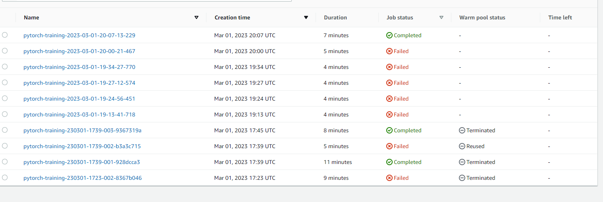
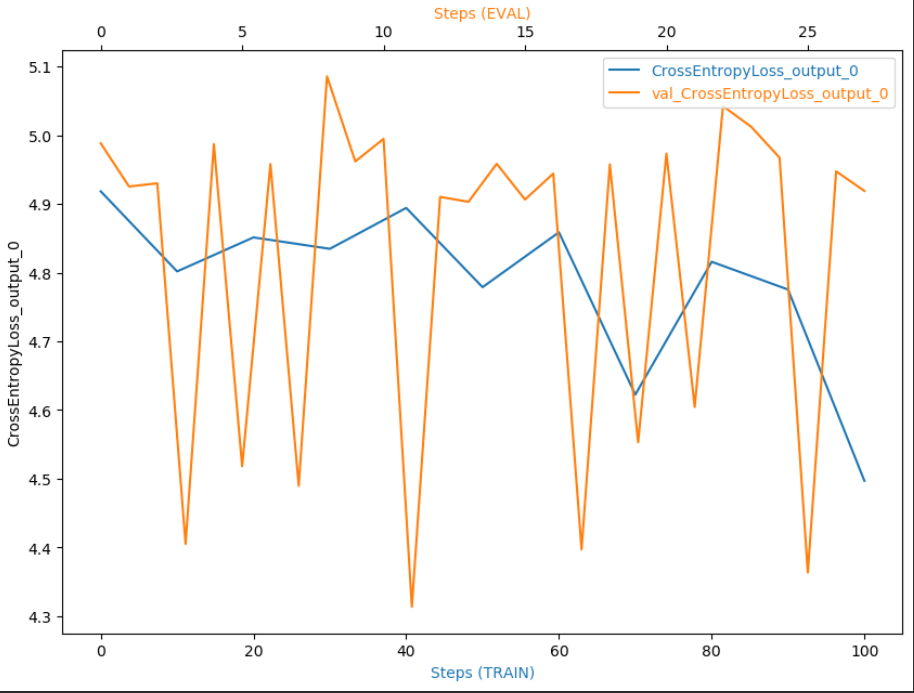
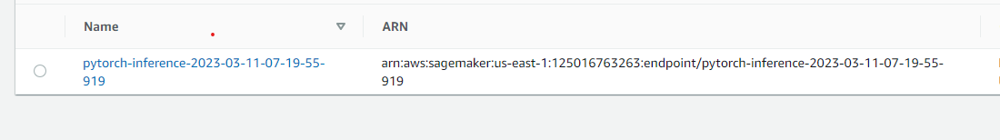

# Image Classification using AWS SageMaker

Use AWS Sagemaker to train a pretrained model that can perform image classification by using the Sagemaker profiling, debugger, hyperparameter tuning and other good ML engineering practices. This can be done on either the provided dog breed classication data set or one of your choice.

## Project Set Up and Installation
Enter AWS through the gateway in the course and open SageMaker Studio. 
Download the starter files.
Download/Make the dataset available. 

## Dataset
The dataset provided is the one for dog breed classification, which is available at this link.
The dataset comprises 133 distinct categories of dogs and contains a total of 8364 dog images.
Out of the total images, 6681 are used for training purposes, while 835 and 848 images are used for validation and testing, respectively.

### Access
Upload the data to an S3 bucket through the AWS Gateway so that SageMaker has access to the data. 

## Hyperparameter Tuning

In this project, I opted to use the pretrained resnet50 model, which is known to perform well for image classification tasks. 
To fine-tune the model's performance, 
I used the `hpo.py` script to tune two hyperparameters: 
the learning rate and the batch size.
The purpose of tuning the learning rate was to determine the optimal rate at 
which the model could learn without overfitting. 
I tested a range of values between 0.001 and 0.1,
and the optimal value was found to be 0.0026026829709314353.

Similarly, I tuned the batch size to find the best value that would optimize the learning process time. I tested a range of values, including 32, 64, 128, 256, and 512, and determined that the optimal batch size was 64.

## Debugging and Profiling
**TODO**: Give an overview of how you performed model debugging and profiling in Sagemaker

To troubleshoot the final model,
I have developed an additional script called `train_model.py`. 
This model utilizes the optimal hyperparameters discovered in the previous step, 
which are a learning rate of 0.0026026829709314353. and a batch size of 64. 
In the Jupiter notebook, I created multiple rules for the debugger and profiler.
the figure below displays the gradual decrease of the learning parameters over time.

### Results
**TODO**: What are the results/insights did you get by profiling/debugging your model?

- The training loss decreases with the number of steps.
- The training loss is a bit noisy, may be this means that the training might have required a larger batch size.
- The validation loss is flactuating rigorosuly .

**TODO** Remember to provide the profiler html/pdf file in your submission.

## Model Deployment
**TODO**: Give an overview of the deployed model and instructions on how to query the endpoint with a sample input.
To enable deployment, it is necessary to generate a supplementary entry point that enables the network to load and preprocess images. These functions are incorporated into the inference.py file, as opposed to the train_model.py file. A sample of the preprocessing technique is available in the train_and_deploy.ipynb notebook.
The trained model yields accurate outcomes for the test image.
**TODO** Remember to provide a screenshot of the deployed active endpoint in Sagemaker.

## Standout Suggestions
**TODO (Optional):** This is where you can provide information about any standout suggestions that you have attempted.
